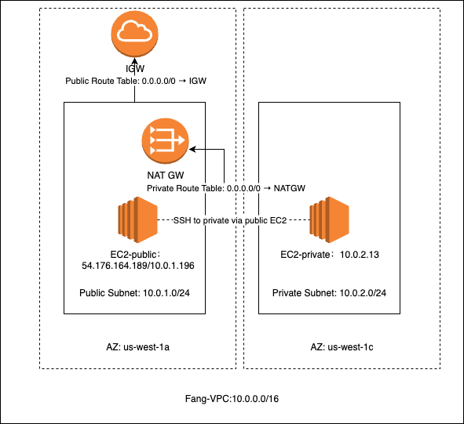

# CS218 - Homework 3: AWS VPC Setup

## Overview
This assignment implements a custom Virtual Private Cloud (VPC) using AWS CLI and Python (Boto3).  
The setup includes one **public subnet** and one **private subnet**, an **Internet Gateway (IGW)**,  
a **NAT Gateway (NATGW)**, and two EC2 instances for verification.

All resources are prefixed with the student’s name for identification (e.g., `fang-vpc`, `fang-ec2-public`).

---

## Network Architecture Example

Below is an example of the AWS VPC architecture implemented for this homework.



**Diagram Description**
- **VPC CIDR:** 10.0.0.0/16  
- **Public Subnet:** 10.0.1.0/24 — hosts a public EC2 instance  
- **Private Subnet:** 10.0.2.0/24 — hosts a private EC2 instance (accessed via the public one)  
- **Internet Gateway (IGW):** attached to the public route table for external connectivity  
- **NAT Gateway (NATGW):** provides outbound internet access for private instances  
- **Availability Zones:** us-west-1a (public), us-west-1c (private)  
- **All resources prefixed with:** `fang-`  

> **Note:**  
> The IP addresses shown in the diagram are **examples** for illustration only.  
> Real instance IPs are omitted for security.

---

## Implementation Details

The automation script (`hw3.py`) was implemented in **Python** using the **Boto3** library.  
It supports the **full lifecycle** of the VPC setup:

### 1. Create  
The script automatically provisions:
- VPC, subnets (public and private)
- Internet Gateway (IGW)
- NAT Gateway (NATGW)
- Route tables and associations
- Security groups
- EC2 instances (public and private)

### 2. Collect  
The script supports a **collect mode** to gather JSON information including:
- Caller identity
- VPC, subnet, and route table details
- EC2 instance metadata

### 3. Teardown  
The teardown command performs **complete cleanup** of all resources created.

The clean creation output was captured in `output.txt` as required.

---

## Files Included for Submission

| File Name | Description |
|------------|--------------|
| `hw3.py` | Automation script (Python + Boto3) |
| `output.txt` | Clean output of creation command (`python hw3.py create --region us-west-1 --prefix fang --key-name ff-test`) |
| `fang-caller-identity.json` | JSON file for caller identity |
| `fang-instances.json` | JSON file for EC2 instance details |
| `fang-subnets.json` | JSON file for subnet details |
| `fang-route-tables.json` | JSON file for route table details |
| `fang-vpc.drawio.png` | Network architecture diagram |

---

## Repository Structure
```
CS218-HW3-VPC-Setup/
│
├── README.md
├── hw3.py
├── output.txt
├── fang-caller-identity.json
├── fang-instances.json
├── fang-subnets.json
├── fang-route-tables.json
└── screenshots/
└── fang-vpc.drawio.png
```

---

## Verification

Verification command example:
```bash
curl -s http://169.254.169.254/latest/dynamic/instance-identity/document
```

## Usage
### Setup
```bash
python3 hw3.py setup --region us-west-1 --prefix fang
```
### Teardown
```bash
python3 hw3.py teardown --region us-west-1 --prefix fang
```

## Author

Fang Fang
CS218 – Cloud Technologies
San José State University
